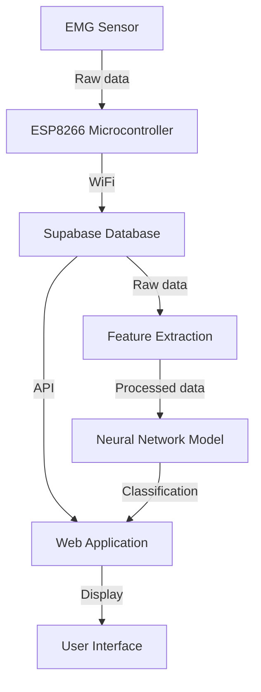

# Muscle Strain Classification System

## Project Overview

This project implements a time series deep learning model to classify strained/damaged muscles from regular/normal muscles. The system uses EMG (Electromyography) sensor data, processes it through a neural network, and provides classification results. This technology can be applied in various settings, including:

- Gyms
- Physical therapy clinics
- Sports medicine facilities
- Occupational health offices
- Ergonomic assessment in workplaces
- Home health monitoring

## System Architecture



## Prerequisites

- Conda environment with the following packages:
  - numpy
  - tensorflow-keras
  - plotly
  - scikit-learn
  - scipy
  - pandas
  - supabase-py
- Supabase account for cloud database
- ESP8266 microcontroller with WiFi module
- EMG sensor (or simulated data for testing)

## Project Components

1. **Data Processing**: Raw EMG data is processed to extract features such as mean, max, min, frequency over duration, and duration of test.

2. **Neural Network Model**: A deep learning model is created and trained on the extracted features to classify muscle strain.

3. **Model Persistence**: The trained neural network model and scalar file (for data preprocessing) are saved for future use.

4. **Database Integration**: Supabase cloud database is used to store and retrieve EMG readings.

5. **Web Application**: A web interface is provided to display graphical reports of EMG readings and classification results.

6. **Microcontroller Code**: Arduino code for the ESP8266 to send EMG readings to the database.

### Data tab from webpage where it fetches the data and can terminate the process any time


### Report tab for detail information with visual representation and the test result


### Visual studio, Supabase and Arduino IDE


### Reading table where the EMG data is pushed from ESP8266 and retrieved to server


### Status table works as flag to know the availabilty to fetch and push


## Setup and Installation

1. Clone this repository:
   ```
   git clone https://github.com/MST-369/First-Aid-Recommender.git
   cd First-Aid-Recommender
   ```

2. Set up the Conda environment:
   ```
   conda create --name muscle_class python=3.8
   conda activate muscle_class
   conda install numpy tensorflow-keras plotly scikit-learn scipy pandas
   pip install supabase
   ```

3. Set up your Supabase project and note down the API key and URL.

4. Update the configuration file with your Supabase credentials.

5. Upload the Arduino code to your ESP8266 microcontroller.

## Usage

1. Collect EMG data using the sensor and ESP8266 setup.
2. Run the feature extraction script:
   ```
   python feature_extraction.py
   ```
3. Train the model:
   ```
   python model.py
   ```
4. Start the web application:
   ```
   streamlit run <file path>
   ```
5. Access the web interface to view results and classifications.

## Contributing

Contributions to this project are welcome. Please fork the repository and submit a pull request with your changes.

## License

[Insert your chosen license here]

## Contact

[Mani Surya Teja] - [manisuryatejak@gmail.com]

Project Link: https://github.com/MST-369/First-Aid-Recommender.git
